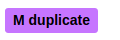

# GitHub-specifics

> As long as Calamares is developed on GitHub, there are some GitHub-specifics
> in the development process.

## Issue Labels

In 2020 Calamares moved to *labeling* issues, hopefully in a consistent manner.
Colors are used to indicate variations on a type of label (e.g. all bugs are red,
but different types of bug-issue are different shares of red).

### Issue Kinds

 -  **Bugs** are labeled in red. There are variations:
   - Bugs caused by (other) bugs in software used by Calamares, are labeled *upstream*.
   - Bugs caused by the way Calamares is delivered to users, or the software it is combined with by distro's, are labeled *downstream*.
 -  **Features** are labeled in blue. There are variations:
   - Features that are relevant for only a single downstream distro, are labeled *distro*.
   - Features that improve an existing thing, are labeled *improvement*.

### Issue Topic

Both bugs and features have a topic: they are about some specific functionality
in Calamares. There are some topics that receive more attention than others,
and for convenience *topic* labels are introduced. These are black.

Topic labels can be deleted when the topic is no longer one that
attracts many issues.

Current (2020) topics include:
 - *partitioning*
 - *lvm2* (support for volume management)
 - *encryption* (support for full/partial encryption of the target system)

### Issue Meta

The issue-meta labels are used to convey information about the issue text
itself, not the problem that the issue addresses. This can be used to
drive an issue-triage effort.

 - **Help** labels are green. They indicate that the issue is understood, and that some kind of help needed or welcome.
   - *Help: wanted* indicates a relatively small task that can be implemented by someone not-very-familiar with the codebase.
   - *Help: test* indicates that the issue **may** be resolved already, but that it needs checking.
 - **Meta** labels are purple. They indicate a problem with the issue text.
   - *Duplicate* issues have been filed more than once; this is often added to the duplicates themselves before they are closed (with a reference to the original issue).
   - *Unclear* means that the issue as-written is not clear to the developers. The submitter needs to provide more information.
     That might mean chatting on IRC to figure out what the exact problem is, or sending screenshots, or .. we will usually
     ask explicitly in the issue as well.
   - *Won't Implement* is another label applied before closing an issue. This is reserved for the special case of "no,
     we won't do that" or "no, we can't do that." While Calamares is a universal installer, it won't do everything and
     there will always be extra-extra-special things that it won't do.
