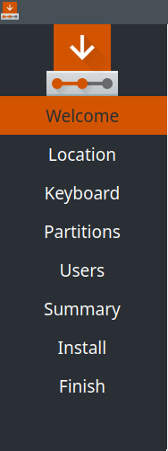
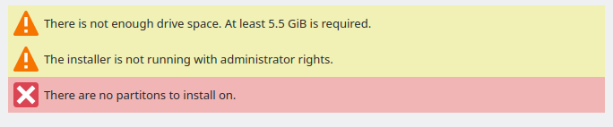
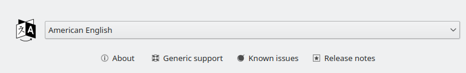
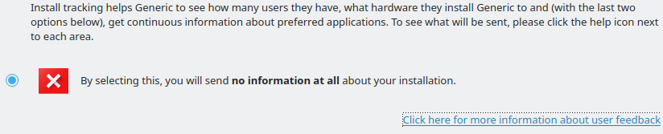

# User's Guide

> This section of the wiki is about **using** Calamares to install
> your system. If you are reading this, it is probably because
> your distribution doesn't have more detailed specific instructions.

Calamares is highly modular and configurable. This
guide explains what Calamares is **capable** of.
Your distribution might not use all of it, or might have
switched some parts off.

## Common Modules

> For nearly all installations, and all configurations of Calamares,
> you will see these modules used.

### Welcome

Welcome to the installer! Here you will find a nice big friendly
logo for your Linux distribution.
Calamares does some basic checking here to see if the system is usable
for installation, and will warn you if something seems to be wrong.

You can change the language of the installer here.
Over fifty languages are supported.
There may be some buttons that link
to your distribution's website (for instance, so you can read
the release notes).

Calamares checks if there is internet connectivity (this is used
by many distributions for package updates) by loading a well-known
page. This is configured by the distribution.

### Location

Where are you? Tell Calamares your timezone.
This also informs some choices like keyboard layout, time and date formats, and currency formats.

Optionally, Calamares can be configured to use GeoIP services to
guess your location. This will use a GeoIP provider configured by the
distribution.

### Keyboard

What does your keyboard look like? Distinguish QWERTY from QWERTZ and all the other
interesting layouts.

### Partitions

What part of the disk do you want to overwrite?

### Users

Your login information, who are you and what is your password?

### Summary

Before making real changes to the system, Calamares summarizes what it is going to do.
This is one more chance to back out before anything irrevocable happens.

### Install

When you reach this step, Calamares does the **actual** work of doing
the installation. Since this can take a long time, you can watch a 
slideshow here. Some distributions even let you play a game while you wait!

### Finish

All done. Calamares will provide a finaly summary and allow you to re-start your machine into your
newly installed Linux operating system.

## Optional Modules

> These are modules for unusual cases or special distributions,
> and you will probably not see them.

### Installation Tracking

> This module is disabled by default, and its default configuration
> turns off all tracking as well. No distribution is known to use it.

Calamares can be configured to do installation tracking. If it is,
you will get a page in the installation process that asks you to
enable installation tracking. If, and only if, you enable installation
tracking, then Calamares will send information **once only** about
your hardware to the server configured by the distribution.

This is used by distributions to count how often they are installed,
and on what kinds of machines -- which helps the distribution tailor
its packages to the machines its users typically use.

When Calamares sends information about the hardware, it sends:
- the make and model of your CPU
- the amount of main memory
- the total amount of attached disk

As part of sending this information, Calamares necessarily makes
your IP address known to the receiving party.

